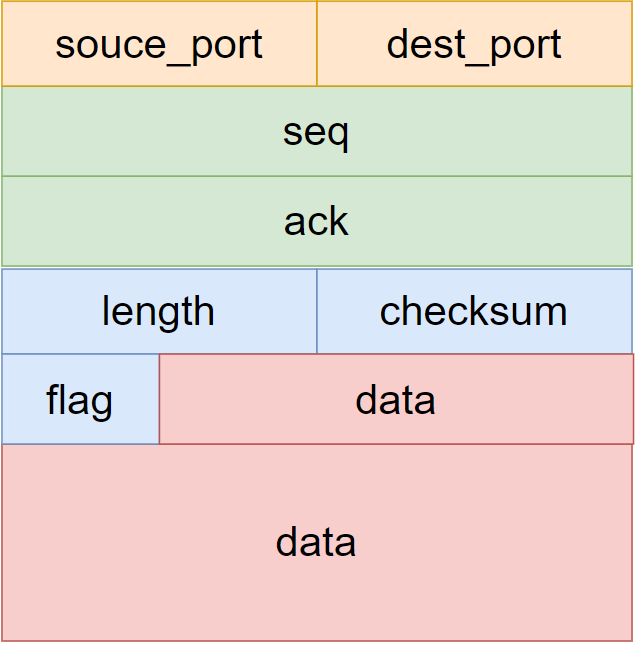

<h1 align = "center">计算机网络实验</h1>

<h3 align = "center">实验3：基于UDP服务设计可靠传输协议并编程实现</h3>

<center><font size='5'><b>实验3-1</b></font>     </center>

<center>姓名： 蒋浩南      &emsp;&emsp;  学号：2012948     </center>

[toc]


## 一、实验要求

* 利用数据报套接字在用户空间实现面向连接的可靠数据传输，功能包括：建立连接、差错检测、确认重传等。流量控制采用停等机制，完成给定测试文件的传输

* 数据报套接字：UDP；

* 建立连接：实现类似TCP的握手、挥手功能； 

* 差错检测：计算校验和；

* 确认重传：rdt2.0、rdt2.1、rdt2.2、rdt3.0等，亦可自行设计协议；

* 单向传输：发送端、接收端； 

* 有必要日志输出


## 二、协议设计

### （一）报文结构



1. 对于报文的设计，含有2字节的源端口，2字节的目标端口，4字节的seq，4字节的ack，2字节的长度，2字节的校验和，1字节的标志，若干字节数据。

长度为传输报文时，记录当前报文所传输数据的有效字节数。

2. 对于标志位：


从低到高分别为ACK，SYN，FIN和END。其中END为在传输文件结束后发送报文的标志位。

### （二）校验和计算和验证

#### (1)伪首部

首先生成伪首部，伪首部结构如下：


分别为源ip，目标ip，长度，版本号和填充0。

#### (2)计算校验和


```c
void setChecksum(msg* message, pseudoHead* ph) {
	//设为0
	message->checksum = 0;
	int sum = 0;
	int len_pseudo = sizeof(pseudoHead);
	int len_msg = sizeof(msg);
	for (int i = 0; i < len_pseudo / 2; i++) {
		sum += ((WORD*)ph)[i];
	}
	for (int i = 0; i < len_msg / 2; i++) {
		sum += ((WORD*)message)[i];
	}   
	while (sum >> 16) {
		sum = (sum & 0xffff) + (sum >> 16);
	}
	message->checksum = ~sum;

};
```

设置校验和的时候，计算伪首部和报文的16位和，取反。

#### (3)验证校验和

```c
bool verfiyChecksum(msg* message, pseudoHead* ph) {

	int sum = 0;
	int len_pseudo = sizeof(pseudoHead);
	int len_msg = sizeof(msg);
	for (int i = 0; i < len_pseudo / 2; i++) {
		sum += ((WORD*)ph)[i];
	}
	for (int i = 0; i < len_msg / 2; i++) {
		sum += ((WORD*)message)[i];
	}
	while (sum >> 16) {
		sum = (sum & 0xffff) + (sum >> 16);
	}
	return sum == 0xffff;
};
```

验证校验和，将生成伪首部，计算伪首部和接收到的报文的16位和，如结果为0xffff，则验证正确。

### （三） 三次握手

对于三次握手

(1) 客户端:

1. 发送同步报文，标记位为SYN,seq=0,ack=0;
2. 开始计时，接收服务器报文，若超时则重传同步报文。
3. 判断接收的报文是否为：标志位（SYN，ACK），seq=0，ack=1。若是发送报文：标志位（ACK），seq=1，ack=1。否则返回退出。

(2) 服务器:

1. 阻塞，接收客户端报文，如果是SYN,seq=0,ack=0。发送报文:标志位（SYN，ACK），seq=0，ack=1；否则循环继续等待接收报文。
2. 非阻塞，开始计时，接收客户端报文，若超时则重传同步报文。
3. 判断接收的报文是否为：标志位（ACK），seq=1，ack=1。若是，建联成功。否则返回退出。


### （四）四次挥手

对于四次挥手

(1) 客户端:

1. 发送结束报文，标记位为FIN。
2. 开始计时，接收服务器报文，若超时则重传报文。
3. 判断接收的报文是否为：标志位（FIN，ACK）。否则继续接收。
4. 阻塞，接收报文，判断是否为：标志位（FIN）。若是，发送报文，标志位（FIN，ACK）。否则继续接收。
5. 等待2msl，如果收到服务器的FIN报文，重传确定报文。
6. 返回退出。

(2) 服务器:

1. 阻塞，接收客户端报文，如果是FIN。发送报文:标志位（FIN，ACK）；否则循环继续等待接收报文。
2. 无要传输的数据，发送FIN报文。
3. 非阻塞，超时重传FIn报文。判断接收的报文是否为(FIN,ACK)，如是断开连接。

### （五）可靠数据传输 rdt3.0


单向传输的rdt3.0。维持两个seq号。

由于三次握手的时候使用了0和1.所以将此处的两个seq号设为2和3。

总体来说，客户端在发送完一个seq号的数据后进入该seq号的确定状态。如果超时则重发数据包。或者收到另一个seq的确定后维持状态不变。

而服务器端在收到当前状态的正确seq号的时候会发送该seq号的ack，转换状态。若收到的seq号为另一状态或损坏，则发送其状态的ack。以希望让客户端进入发送下一seq的状态。


## 三、代码实现

### （一）初始化

以下分别为客户端和服务器的初始化。

客户端：

```c
void init() {

	//Startup
	WSADATA wsadata;
	WORD version;
	version = MAKEWORD(2, 2);
	int result_start;
	result_start = WSAStartup(version, &wsadata);

	if (result_start != 0) {
		cout << "Startup failed" << endl;
		return;
	}

	//client and server  addr

	addr_client.sin_port = htons(port_client);					//port
	addr_client.sin_addr.S_un.S_addr = inet_addr(ip_client); //ip addr
	addr_client.sin_family = AF_INET;

	addr_server.sin_port = htons(port_route);
	addr_server.sin_addr.S_un.S_addr = inet_addr(ip_route);
	addr_server.sin_family = AF_INET;
	//creat socket
	sockClient = socket(AF_INET, SOCK_DGRAM, 0);
	if (sockClient == INVALID_SOCKET) {
		cout << "socket creat failed" << endl;
		return;
	}

	u_long imode = 1;
	ioctlsocket(sockClient, FIONBIO, &imode);//非阻塞

	//bind
	int result_bind;
	result_bind = bind(sockClient, (SOCKADDR*)&addr_client, sizeof(SOCKADDR_IN));
	if (result_bind == SOCKET_ERROR) {
		cout << "bind failed" << endl;
		return;
	}

	//初始化伪头部
	memset(&ph, 0, sizeof(pseudoHead));
	ph.source_ip = inet_addr(ip_client);
	ph.dest_ip = inet_addr(ip_server);

	cout << "初始化成功，客户端开始建接"<<endl;

};
```

服务器：

```c
void init() {

	//Startup
	WSADATA wsadata;
	WORD version;
	version = MAKEWORD(2, 2);
	int result_start;
	result_start = WSAStartup(version, &wsadata);

	if (result_start != 0) {
		cout << "Startup failed" << endl;
		return;
	}

	//client and server  addr

	addr_client.sin_port = htons(port_route);					//port
	addr_client.sin_addr.S_un.S_addr = inet_addr(ip_route); //ip addr
	addr_client.sin_family = AF_INET;

	addr_server.sin_port = htons(port_server);
	addr_server.sin_addr.S_un.S_addr = inet_addr(ip_server);
	addr_server.sin_family = AF_INET;

	//creat socket
	sockServer = socket(AF_INET, SOCK_DGRAM, 0);
	if (sockServer == INVALID_SOCKET) {
		cout << "socket creat failed" << endl;
		return;
	}

	//bind
	int result_bind;
	result_bind = bind(sockServer, (SOCKADDR*)&addr_server, sizeof(SOCKADDR_IN));
	if (result_bind == SOCKET_ERROR) {
		cout << "bind failed" << endl;
		return;
	}

	//初始化伪首部
	memset(&ph, 0, sizeof(pseudoHead));
	ph.source_ip = inet_addr(ip_client);
	ph.dest_ip = inet_addr(ip_server);

	cout << "初始化成功，服务器端开始建接" << endl;

}
```

### （二）建立连接

客户端：

```c
bool establishConnect() {

	int len = sizeof(SOCKADDR_IN);
	char recBuffer[sizeof(msg)];	//接收缓冲区
	char sendBuffer[sizeof(msg)];	//发送缓冲区
	memset(recBuffer, 0, sizeof(msg));
	memset(sendBuffer, 0, sizeof(msg));
	msg* sed = (msg*)sendBuffer;		
	msg* rec = (msg*)recBuffer;
	
	setSyn(sed);		//设置SYN
	sed->seq_num = 0;	//设置seq=0
	sed->ack_num = 0;	//设置ack=0
	sed->source_port = port_client;
	sed->dest_port = port_server;
	setChecksum(sed, &ph);	//设置校验和

	//发送
	sendto(sockClient, sendBuffer, sizeof(msg), 0, (sockaddr*)&addr_server, len);
	
	clock_t start = clock(); //开始计时

	while (recvfrom(sockClient, recBuffer, sizeof(msg), 0, (sockaddr*)&addr_server, &len) <= 0) {
			
		if (clock() - start >= MAX_TIME) {		
			//超时重传
			sendto(sockClient, sendBuffer, sizeof(msg), 0, (sockaddr*)&addr_server, len);
			start = clock();
		}
	}
	cout << "客户端:接收到报文（SYN，ACK）" << endl;
	
	if (isAck(rec) && isSyn(rec) && verfiyChecksum(rec, &ph)) {

			cout << "客户端:接收报文（SYN，ACK）验证正确" << endl;
			memset(sendBuffer, 0, sizeof(msg));
			setAck(sed);	//设置ack
			sed->seq_num = 1;
			sed->ack_num = 1;
			sed->source_port = port_client;
			sed->dest_port = port_server;
			setChecksum(sed, &ph);
			sendto(sockClient, sendBuffer, sizeof(msg), 0, (sockaddr*)&addr_server, len);
			
		}
	else {
			cout << "客户端:接收报文（SYN，ACK）验证错误" << endl;			
			return 0;
			
		}
	
	cout << "客户端： 建立连接成功" << endl;
		return true;

};
```

服务器：

```c
bool establishConnect() {

	int len = sizeof(SOCKADDR_IN);
	char recBuffer[sizeof(msg)];	//接收缓冲区
	char sendBuffer[sizeof(msg)];	//发送缓冲区
	msg* sed = (msg*)sendBuffer;
	msg* rec = (msg*)recBuffer;
	memset(recBuffer, 0, sizeof(msg));
	memset(sendBuffer, 0, sizeof(msg));

	while (1) {

		//阻塞，接收SYN
		recvfrom(sockServer, recBuffer, sizeof(msg), 0, (sockaddr*)&addr_client, &len);

		if (isSyn(rec) && verfiyChecksum(rec, &ph) && rec->seq_num==0) {		
			cout << "服务器端： 接收到客户端SYN报文，验证成功" << endl;

			//设置SYN，ACK报文
			setAck(sed);
			setSyn(sed);
			sed->seq_num = 0;
			sed->ack_num = 1;
			sed->source_port = port_server;
			sed->dest_port = port_client;
			setChecksum(sed, &ph);
			//发送SYN，ACK
			sendto(sockServer, sendBuffer, sizeof(msg), 0, (sockaddr*)&addr_client, len);
			break;
		}
		else {		
			cout << "服务器端： 接收到客户端SYN报文，验证失败" << endl;
			continue;		
		}
	}
	//设为非阻塞
	u_long imode = 1;
	ioctlsocket(sockServer, FIONBIO, &imode);//非阻塞


	clock_t start = clock(); //开始计时
	while (recvfrom(sockServer, recBuffer, sizeof(msg), 0, (sockaddr*)&addr_client, &len) <= 0) {
			
		// over time
		if (clock() - start >= MAX_TIME) {

			//超时重传
			sendto(sockServer, sendBuffer, sizeof(msg), 0, (sockaddr*)&addr_client, len);
			cout << "服务器端： 重传报文（SYN，ACK）" << endl;
			start = clock();
		}
	}
	if (isAck(rec) && verfiyChecksum(rec, &ph)) {

		cout << "服务器端：接收到客户端报文（SYN，ACK）验证正确" << endl;
	}
	else {
	
		return false;
	}

	imode = 0;
	ioctlsocket(sockServer, FIONBIO, &imode);//阻塞
	return true;

}
```

### （三）确认重传，rdt3.0

客户端：

打包函数：根据要打包的长度，设置seq，将传输数据打包进报文，返回报文。

```c
msg make_pkt( int seq, char * data , unsigned short len  ) {
	msg message;
	memset(&message, 0, sizeof(msg));
	message.source_port = port_client;
	message.dest_port = port_server;
	message.length = len;
	message.seq_num = seq;
	memcpy(message.msg, data, len);
	pseudoHead ph;		//伪首部
	memset(&ph, 0, sizeof(pseudoHead));
	ph.source_ip = inet_addr(ip_client);
	ph.dest_ip = inet_addr(ip_server);
	setChecksum(&message, &ph);	//设置校验和
	return message;
}
```

有限状态机：

* 根据数据的总长度和最大报文数据长度，可以计算需要发送多少包，每个包的数据段长度，将该长度写入报文的length中。
* 在状态机的循环开始处，判断是否已经将所有的包发完并且得到确认。如果是，则发送标志位为（END）的报文，该报文的数据部分为所要传输的文件的名。并设置超时重传，以保证服务器得到。
* 接收到报文（END，ACK），退出。
* 四个状态按照rdt3.0的状态转移。

```c
void rdt3_send_FSM(unsigned long length_file ,char * file,char * filename) {

	int packetNUM = int(length_file / Max_Size) + (length_file % Max_Size ? 1 : 0);
	cout << "packetNUM: " << packetNUM << endl;
	int index = 0;
	int stage = 0;
	int len = sizeof(SOCKADDR_IN);
	int	packetDataLen = min(Max_Size, length_file - index * Max_Size);
	char *dataBuffer=new char[Max_Size];
	char *pktBuffer = new char[sizeof(msg)];
	char* recpktBuffer = new char[sizeof(msg)];
	msg sndpkt;
	clock_t start_timer;


	msg* rec = (msg*)recpktBuffer;
	cout << "本次文件数据长度为    " << length_file << "Bytes,    需要传输" << packetNUM << "个数据包" << endl;

	while (1) {
		

		//发送传输结束报文
		if (index == packetNUM) {

			u_long imode = 1;
			ioctlsocket(sockClient, FIONBIO, &imode);//非阻塞
			
		
			char* sendBuffer = new char[sizeof(msg)];
			memset(sendBuffer, 0, sizeof(msg));
			msg *sed = (msg*)sendBuffer;
			setEnd(sed);		
			sed->source_port = port_client;
			sed->dest_port = port_server;
			string fn = filename;
			int filename_len = sizeof(fn);

			memcpy(sed->msg, filename, filename_len);
			sed->length = filename_len;
			setChecksum(sed, &ph);	//设置校验和

			//发送
			sendto(sockClient, sendBuffer, sizeof(msg), 0, (sockaddr*)&addr_server, len);
			cout << "客户端： 发送报文（END）" << endl;

			clock_t start_timer = clock(); //开始计时

			while (recvfrom(sockClient, recpktBuffer, sizeof(msg), 0, (sockaddr*)&addr_server, &len) <= 0||!(isEnd(rec)&&isAck(rec))) {
				// over time
				if (clock() - start_timer >= MAX_TIME) {

					//超时重传
					sendto(sockClient, sendBuffer, sizeof(msg), 0, (sockaddr*)&addr_server, len);
					cout << "客户端： 发送报文（END）,重传" << endl;
					start_timer = clock();
				}
			}

			
			if (isEnd(rec)&&isAck(rec) && verfiyChecksum(rec, &ph) ) {
				cout << "客户端：接收服务器报文（END，ACK），文件传输完成" << endl;
				return ;
			}
			else
				continue;
		}

		//传输数据长度
		packetDataLen=min(Max_Size, length_file - index * Max_Size);

		switch (stage) {
			case 0:
				memcpy(dataBuffer, file+index* Max_Size, packetDataLen);
				sndpkt = make_pkt(2, dataBuffer, packetDataLen);
				memcpy(pktBuffer, &sndpkt, sizeof(msg));
				sendto(sockClient, pktBuffer, sizeof(msg), 0, (sockaddr*)&addr_server, len);
				start_timer = clock();
				stage = 1;
				cout << "状态0\t发送\tseq:\t2\tindex:\t" << index <<"\tlength:\t"<< packetDataLen << "\tchecksum:\t"<<sndpkt.checksum << endl;
				break;

			case 1:

				//超时重传
				if (clock() - start_timer >= MAX_TIME) {
					sendto(sockClient, pktBuffer, sizeof(msg), 0, (sockaddr*)&addr_server, len);
					cout << "状态1\t发送\tseq:\t2\tindex:\t" << index << "\tlength:\t" << packetDataLen << "\tchecksum:\t" << sndpkt.checksum << "  (重传)" << endl;
					start_timer = clock();
				}
		
				
				if (recvfrom(sockClient, recpktBuffer, sizeof(msg), 0, (sockaddr*)&addr_server, &len)) {
					if (isAck(rec) && verfiyChecksum(rec, &ph) && rec->ack_num == 2) {
						cout << "状态1\t接收\tack:\t2\tAck:\t" << isAck(rec) << "\tlength:\t" << rec->length << "\tchecksum:\t" << rec->checksum  << endl;
						stage = 2;
						index++;
						break;
					}
				}
				break;

			case 2:
				memcpy(dataBuffer, file + index * Max_Size, packetDataLen);
				sndpkt = make_pkt(3, dataBuffer, packetDataLen);
				memcpy(pktBuffer, &sndpkt, sizeof(msg));
				sendto(sockClient, pktBuffer, sizeof(msg), 0, (sockaddr*)&addr_server, len);
				cout << "状态2\t发送\tseq:\t3\tindex:\t" << index << " \tlength:\t" << packetDataLen << " \tchecksum:\t" << sndpkt.checksum << endl;
				start_timer = clock();
				stage = 3;
				break;


			case 3:

				//超时重传
				if (clock() - start_timer >= MAX_TIME) {
					sendto(sockClient, pktBuffer, sizeof(msg), 0, (sockaddr*)&addr_server, len);
					cout << "状态3\t发送\tseq:\t3\tindex:\t" << index << "\tlength:\t" << packetDataLen << " \tchecksum:\t" << sndpkt.checksum << "  (重传)" << endl;

					start_timer = clock();
				}


				if (recvfrom(sockClient, recpktBuffer, sizeof(msg), 0, (sockaddr*)&addr_server, &len)) {
					if (isAck(rec) && verfiyChecksum(rec, &ph) && rec->ack_num == 3) {
						cout << "状态3\t接收\tack:\t3\tAck:\t" << isAck(rec) << "\tlength:\t" << rec->length << "\tchecksum:\t" << rec->checksum << endl;
						stage = 0;
						index++;
						break;
					}
				}
				break;
		}
	}	
}

```

服务器：

打包函数：，设置ack，返回报文。

```c
msg make_pkt(int ack) {

	msg message;
	memset(&message, 0, sizeof(msg));
	message.source_port = port_client;
	message.dest_port = port_server;
	setAck(&message);
	message.ack_num = ack;
	pseudoHead ph;		//伪首部
	memset(&ph, 0, sizeof(pseudoHead));
	ph.source_ip = inet_addr(ip_client);
	ph.dest_ip = inet_addr(ip_server);
	setChecksum(&message, &ph);	//设置校验和

	return message;
}

```

有限状态机：

* 两个状态，在rdt3.0的基础之上，每个状态增加判断接受的包是否为（END）。在该报文中得到所传输文件的文件名。
* 发送确定报文（END，ACK）。

```c
DWORD rdt3_receive_FSM(char* file,char *filename) {


	int index = 0;
	int stage = 0;

	int len = sizeof(SOCKADDR_IN);

	char* pktBuffer = new char[sizeof(msg)];
	char* recpktBuffer = new char[sizeof(msg)];
	char* sendBuffer = new char[sizeof(msg)];

	DWORD rec_data_len = 0;
	msg* rec = (msg*)recpktBuffer;

	//传输请求
	u_long imode = 0;
	if(ioctlsocket(sockServer, FIONBIO, &imode)==SOCKET_ERROR)
	cout << "error" << endl;

	bool start_tran = 0;

	while (1) {		
		memset(recpktBuffer, 0, sizeof(msg));

		switch (stage) {
		case 0:
			
			if (recvfrom(sockServer, recpktBuffer, sizeof(msg), 0, (sockaddr*)&addr_client, &len) > 0 &&  rec->length!=0) {	
			}
			else {
				
				break;
			}

			if (isEnd(rec)&& start_tran) {
				memcpy(filename, rec->msg, rec->length);
				cout << "传输完毕" << endl;
				memset(sendBuffer, 0, sizeof(msg));
				msg sed = make_pkt(0);
				setEnd(&sed);
				sed.checksum = 0;
				setChecksum(&sed, &ph);	

				memcpy(sendBuffer, &sed, sizeof(msg));
				
				sendto(sockServer, sendBuffer, sizeof(msg), 0, (sockaddr*)&addr_client, len);
				cout << "服务器: 发送报文（END，ACK）" << endl;
				return rec_data_len;
			}


			if (rec->seq_num == 3 || !(verfiyChecksum(rec, &ph))) {

				msg sedpkt = make_pkt(3);
				memcpy(sendBuffer, &sedpkt, sizeof(msg));
				sendto(sockServer, sendBuffer, sizeof(msg), 0, (sockaddr*)&addr_client, len);
				cout << "状态0\t接收\tseq:\t3\t" << endl;
				cout << "状态0\t发送\tack:\t3\ACK:\t" << isAck(&sedpkt) << "\tlength:\t" << sedpkt.length << "\tchecksum:\t" << sedpkt.checksum << endl;

				stage = 0;
				cout << "在状态0时收到seq1" << endl;
				break;

			}

			//正确接收
			if (rec->seq_num == 2 && (verfiyChecksum(rec, &ph))) {

				msg sedpkt = make_pkt(2);
				memcpy(sendBuffer, &sedpkt, sizeof(msg));
				sendto(sockServer, sendBuffer, sizeof(msg), 0, (sockaddr*)&addr_client, len);
				cout << "状态0\t接收\tseq:\t2\tindex:\t" << index << "\tlength:\t" << rec->length << "\tchecksum:\t" << rec->checksum << endl;
				cout << "状态0\t发送\tack:\t2\ACK:\t" << isAck(&sedpkt) << "\tlength:\t" << sedpkt.length << "\tchecksum:\t" << sedpkt.checksum << endl;				
				memcpy(file + rec_data_len, rec->msg, rec->length);
				rec_data_len += rec->length;
				stage = 1;
				start_tran = 1;
				index++;
				break;

			}
			break;


		case 1:

			recvfrom(sockServer, recpktBuffer, sizeof(msg), 0, (sockaddr*)&addr_client, &len);

			if (isEnd(rec)&& start_tran) {

				memcpy(filename, rec->msg, rec->length);
				cout << "传输完毕" << endl;
				memset(sendBuffer, 0, sizeof(msg));
				msg sed = make_pkt(0);
				setEnd(&sed);
				sed.checksum = 0;
				setChecksum(&sed, &ph);
				memcpy(sendBuffer, &sed, sizeof(msg));
				sendto(sockServer, sendBuffer, sizeof(msg), 0, (sockaddr*)&addr_client, len);

				return rec_data_len;
			}


			if (rec->seq_num == 2 || !(verfiyChecksum(rec, &ph))) {

				msg sedpkt = make_pkt(2);
				memcpy(sendBuffer, &sedpkt, sizeof(msg));
				sendto(sockServer, sendBuffer, sizeof(msg), 0, (sockaddr*)&addr_client, len);
				cout << "状态1\t接收\tseq:\t2\t" << endl;
				cout << "状态1\t发送\tack:\t2\ACK:\t" << isAck(&sedpkt) << "\tlength:\t" << sedpkt.length << "\tchecksum:\t" << sedpkt.checksum << endl;

				stage = 1;

				break;

			}

			if (rec->seq_num == 3 && (verfiyChecksum(rec, &ph))) {

				msg sedpkt = make_pkt(3);
				memcpy(sendBuffer, &sedpkt, sizeof(msg));
				sendto(sockServer, sendBuffer, sizeof(msg), 0, (sockaddr*)&addr_client, len);
				cout << "状态1\t接收\tseq:\t3\tindex:\t" << index << "\tlength:\t" << rec->length << "\tchecksum:\t" << rec->checksum << endl;
				cout << "状态1\t发送\tack:\t3\ACK:\t" << isAck(&sedpkt) << "\tlength:\t" << sedpkt.length << "\tchecksum:\t" << sedpkt.checksum << endl;
				memcpy(file + rec_data_len, rec->msg, rec->length);
				rec_data_len += rec->length;
				start_tran = 1;
				stage = 0;
				index++;
				break;
			}
			break;
		}
	}
	
}
```

### （四）四次挥手

客户端：

```c
bool closeConnect() {

	int len = sizeof(SOCKADDR_IN);
	char recBuffer[sizeof(msg)];	//接收缓冲区
	char sendBuffer[sizeof(msg)];	//发送缓冲区

	memset(recBuffer, 0, sizeof(msg));
	memset(sendBuffer, 0, sizeof(msg));

	msg* sed = (msg*)sendBuffer;
	msg* rec = (msg*)recBuffer;

	//（1）客户端发送FIN报文
	setFin(sed);		//设置Fin
	sed->seq_num = 0;	//设置seq=0
	sed->ack_num = 0;	//设置ack=0
	sed->source_port = port_client;
	sed->dest_port = port_server;

	setChecksum(sed, &ph);	//设置校验和

	//发送
	sendto(sockClient, sendBuffer, sizeof(msg), 0, (sockaddr*)&addr_server, len);
	cout << "客户端：发送报文（FIN）" << endl;

	clock_t start = clock(); //开始计时

	//（2）接收确定服务器端的FIN，ACK报文
	while (recvfrom(sockClient, recBuffer, sizeof(msg), 0, (sockaddr*)&addr_server, &len) <= 0) {
			
		if (clock() - start >= MAX_TIME) {
			//超时重传
			sendto(sockClient, sendBuffer, sizeof(msg), 0, (sockaddr*)&addr_server, len);
			cout << "客户端：发送报文（FIN），重传" << endl;
			start = clock();
		}
	}

	if (isAck(rec) && isFin(rec) && verfiyChecksum(rec, &ph)) {
		cout << "客户端：接收报文（FIN，ACK）验证正确" << endl;
	}
	else {
	
		return false;
	}
	u_long imode = 0;
	ioctlsocket(sockClient, FIONBIO, &imode);//阻塞

	//（3）接收确定服务器端的FIN报文

	while (1) {
		recvfrom(sockClient, recBuffer, sizeof(msg), 0, (sockaddr*)&addr_server, &len);

		if (isFin(rec) && verfiyChecksum(rec, &ph)) {

			cout << "客户端：接收到服务器报文（FIN），验证正确" << endl;
			break;
		}
	}

	imode = 1;
	ioctlsocket(sockClient, FIONBIO, &imode);//非阻塞

	//（4）发送FIN，ACK报文
	cleanflag(sed);
	setFin(sed);
	setAck(sed);
	setChecksum(sed, &ph);	//设置校验和
	sendto(sockClient, sendBuffer, sizeof(msg), 0, (sockaddr*)&addr_server, len);
	cout << "客户端：发送报文（FIN，ACK）" << endl;

	//等待2MSL
	start = clock(); //开始计时

	while (clock() - start <= 2 * MAX_TIME) {
		if (recvfrom(sockClient, recBuffer, sizeof(msg), 0, (sockaddr*)&addr_server, &len) > 0&& isFin(rec) && verfiyChecksum(rec, &ph)) {
			sendto(sockClient, sendBuffer, sizeof(msg), 0, (sockaddr*)&addr_server, len);
			cout << "客户端: 发送报文（FIN，ACK）,重传" << endl;
		}
	}

	cout << "客户端：连接关闭" << endl;
	closesocket(sockClient);
	return true;

};
```

服务器端：

```c
bool closeConnect() {

	int len = sizeof(SOCKADDR_IN);
	char recBuffer[sizeof(msg)];	//接收缓冲区
	char sendBuffer[sizeof(msg)];	//发送缓冲区
	memset(recBuffer, 0, sizeof(msg));
	memset(sendBuffer, 0, sizeof(msg));

	msg* sed = (msg*)sendBuffer;
	msg* rec = (msg*)recBuffer;
    
	u_long imode = 0;
	ioctlsocket(sockServer, FIONBIO, &imode);//阻塞

	//（1）接收验证客户端的FIN报文。
	while (1) {
		recvfrom(sockServer, recBuffer, sizeof(msg), 0, (sockaddr*)&addr_server, &len);

		if (isFin(rec) && verfiyChecksum(rec, &ph)) {

			cout << "服务器： 收到客户端Fin请求，验证正确" << endl;
			break;
		}
	}
	//（2）服务器：设置发送ACK，FIN报文

	setFin(sed);		//设置Fin
	setAck(sed);		//设置Ack
	sed->seq_num = 0;	//设置seq=0
	sed->ack_num = 0;	//设置ack=0
	sed->source_port = port_client;
	sed->dest_port = port_server;
	setChecksum(sed, &ph);	//设置校验和

	//发送
	sendto(sockServer, sendBuffer, sizeof(msg), 0, (sockaddr*)&addr_client, len);

	//剩余数据

	//发送FIN
	cleanflag(sed);
	setFin(sed);		//设置Fin
	setChecksum(sed, &ph);
	sendto(sockServer, sendBuffer, sizeof(msg), 0, (sockaddr*)&addr_client, len);


	imode = 1;
	ioctlsocket(sockServer, FIONBIO, &imode);//非阻塞

	//接收
	clock_t  start = clock(); //开始计时
	while (recvfrom(sockServer, recBuffer, sizeof(msg), 0, (sockaddr*)&addr_server, &len) <= 0 ||!(isAck(rec) && isFin(rec) && verfiyChecksum(rec, &ph)) ) {

		// over time
		if (clock() - start >= MAX_TIME) {

			//超时重传
			sendto(sockServer, sendBuffer, sizeof(msg), 0, (sockaddr*)&addr_client, len);
			cout << "服务器： 发送报文（FIN），重传" << endl;
			start = clock();
		}
	}

	if (isAck(rec) && isFin(rec) && verfiyChecksum(rec, &ph)) {
		cout << "服务器： 接收到报文（FIN，ACK），验证正确" << endl;
	}
	else {
		return false;
	}

	cout << "连接关闭" << endl;
	closesocket(sockServer);
	return true;
};

```

### （五）文件读和写

客户端：

* 选择要读文件，文件内容读入缓冲区，获得文件名。

```c
	while (1) {

		char* filename = new char[100];
		memset(filename, 0, 100);
		string filedir;

		cout << endl;
		cout << "/*****************************************************/" << endl;
		cout << "默认: 1.jpg" << endl;
		cout << "1: 1.jpg" << endl;
		cout << "2: 2.jpg" << endl;
		cout << "3: 3.jpg" << endl;
		cout << "4: helloworld.txt" << endl;
		cout << "5: 退出" << endl;
		cout << "请输入要传输的文件： " << endl;
		int i;
		cin >> i;
		
		cout << endl;
		cout << "/*****************************************************/" << endl;

		if (i == 5) {
			cout << "传输结束 " << endl;
			break;
		}
		switch (i) {
		case 1:
			//filedir = "C:/Users/nan/Desktop/lab3/lab3_1/test file/1.jpg";
			filedir = "test file/1.jpg";
			memcpy(filename, "1.jpg", sizeof("1.jpg"));
			break;
		case 2:
			//filedir = "C:/Users/nan/Desktop/lab3/lab3_1/test file/2.jpg";
			filedir = "test file/2.jpg";
			memcpy(filename, "2.jpg", sizeof("2.jpg"));	
			break;
		case 3:

			//filedir = "C:/Users/nan/Desktop/lab3/lab3_1/test file/3.jpg";
			filedir = "test file/3.jpg";
			memcpy(filename, "3.jpg", sizeof("3.jpg"));
			break;
		case 4:

			//filedir = "C:/Users/nan/Desktop/lab3/lab3_1/test file/helloworld.txt";
			filedir = "test file/helloworld.txt";
			memcpy(filename, "helloworld.txt", sizeof("helloworld.txt"));
			break;
		default:
			//filedir = "C:/Users/nan/Desktop/lab3/lab3_1/test file/1.jpg";
			filedir = "test file/1.jpg";
			memcpy(filename, "1.jpg", sizeof("1.jpg"));
			break;
		}
		
		ifstream infile(filedir, ifstream::binary);
		if (!infile.is_open()) {
			cout << "无法打开文件" << endl;
			return 0;
		}

		infile.seekg(0, infile.end);
		DWORD fileLen = infile.tellg();
		infile.seekg(0, infile.beg);
		cout<<"传输文件长度: " << fileLen << endl;
		char* fileBuffer = new char[fileLen];
		infile.read(fileBuffer, fileLen);
		infile.close();
		cout << "开始传输文件: "<< i << endl;
		clock_t start_timer = clock();
		rdt3_send_FSM(fileLen, fileBuffer,filename);
		clock_t end_timer = clock();
		double endtime = (double)(end_timer - start_timer) / CLOCKS_PER_SEC;
		cout << "Total time:" << endtime <<" s" << endl;		
		cout << "吞吐率：" << fileLen * 8 / endtime / 1024 / 1024 << "Mbps" << endl;

	}
```


服务器：

* 获得文件内容和文件名。
* 写入

```c
	bool tran = 1;

	while (tran) {
		char* fileBuffer = new char[90000000];
		DWORD fileLength = 0;
		char* filename = new char[100];
		memset(filename, 0, 100);
		fileLength = rdt3_receive_FSM(fileBuffer, filename);
		cout << "/*****************************************************/" << endl;
		cout << endl;
		//string dir = "C:/Users/nan/Desktop/lab3/lab3_1/rec file/";
		string dir = "rec file/";
		string  fn = filename;
		string filenm = dir + fn;
		//写入文件
		ofstream outfile(filenm, ios::binary);
		outfile.write(fileBuffer, fileLength);
		outfile.close();
		cout << "是否继续接受传输（Y/N）： ";
		char i;
		cin >> i;
		cout << "/*****************************************************/" << endl;
		cout << endl;
		switch (i)
		{
		case 'y':
			tran = 1;
			break;
		case 'n':
			tran = 0;
			break;
		default:
			break;
		}

	}
```


## 四、程序演示

* (1)


路由器：
ip：127.0.0.1 端口: 4001;

server:
ip：127.0.0.1 端口: 4000;

* (2)建立连接


* （3）传输

客户端：


服务器：


传输结果：


* (4)断开连接


## 五、代码库

[lab3_1 · nan/computer_network](https://gitee.com/jhnan/computer_network/tree/master/lab3_1)