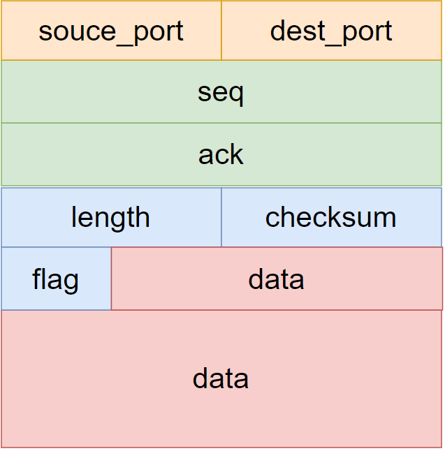

<h1 align = "center">计算机网络实验</h1>

<h3 align = "center">实验3：基于UDP服务设计可靠传输协议并编程实现</h3>

<center><font size='5'><b>实验3-3</b></font>     </center>

<center>姓名： 蒋浩南      &emsp;&emsp;  学号：2012948     </center>

[toc]


## 一、实验要求

* 在实验3-2的基础上，选择实现一种拥塞控制 算法，也可以是改进的算法，完成给定测试文件的传输。

*  RENO算法； 

* 也可以自行设计协议或实现其他拥塞控制算法；

*  给出实现的拥塞控制算法的原理说明； 

* 有必要日志输出（须显示窗口大小改变情况）。


## 二、协议设计

### （一）报文结构



1. 对于报文的设计，含有2字节的源端口，2字节的目标端口，4字节的seq，4字节的ack，2字节的长度，2字节的校验和，1字节的标志，若干字节数据。

长度为传输报文时，记录当前报文所传输数据的有效字节数。

2. 对于标志位：


从低到高分别为ACK，SYN，FIN和END。其中END为在传输文件结束后发送报文的标志位。

### （二）校验和计算和验证

#### (1)伪首部

首先生成伪首部，伪首部结构如下：


分别为源ip，目标ip，长度，版本号和填充0。

#### (2)计算校验和


```c
void setChecksum(msg* message, pseudoHead* ph) {
	//设为0
	message->checksum = 0;
	int sum = 0;
	int len_pseudo = sizeof(pseudoHead);
	int len_msg = sizeof(msg);
	for (int i = 0; i < len_pseudo / 2; i++) {
		sum += ((WORD*)ph)[i];
	}
	for (int i = 0; i < len_msg / 2; i++) {
		sum += ((WORD*)message)[i];
	}   
	while (sum >> 16) {
		sum = (sum & 0xffff) + (sum >> 16);
	}
	message->checksum = ~sum;

};
```

设置校验和的时候，计算伪首部和报文的16位和，取反。

#### (3)验证校验和

```c
bool verfiyChecksum(msg* message, pseudoHead* ph) {

	int sum = 0;
	int len_pseudo = sizeof(pseudoHead);
	int len_msg = sizeof(msg);
	for (int i = 0; i < len_pseudo / 2; i++) {
		sum += ((WORD*)ph)[i];
	}
	for (int i = 0; i < len_msg / 2; i++) {
		sum += ((WORD*)message)[i];
	}
	while (sum >> 16) {
		sum = (sum & 0xffff) + (sum >> 16);
	}
	return sum == 0xffff;
};
```

验证校验和，将生成伪首部，计算伪首部和接收到的报文的16位和，如结果为0xffff，则验证正确。

### （三） 三次握手

对于三次握手

(1) 客户端:

1. 发送同步报文，标记位为SYN,seq=0,ack=0;
2. 开始计时，接收服务器报文，若超时则重传同步报文。
3. 判断接收的报文是否为：标志位（SYN，ACK），seq=0，ack=1。若是发送报文：标志位（ACK），seq=1，ack=1。否则返回退出。

(2) 服务器:

1. 阻塞，接收客户端报文，如果是SYN,seq=0,ack=0。发送报文:标志位（SYN，ACK），seq=0，ack=1；否则循环继续等待接收报文。
2. 非阻塞，开始计时，接收客户端报文，若超时则重传同步报文。
3. 判断接收的报文是否为：标志位（ACK），seq=1，ack=1。若是，建联成功。否则返回退出。


### （四）四次挥手

对于四次挥手

(1) 客户端:

1. 发送结束报文，标记位为FIN。
2. 开始计时，接收服务器报文，若超时则重传报文。
3. 判断接收的报文是否为：标志位（FIN，ACK）。否则继续接收。
4. 阻塞，接收报文，判断是否为：标志位（FIN）。若是，发送报文，标志位（FIN，ACK）。否则继续接收。
5. 等待2msl，如果收到服务器的FIN报文，重传确定报文。
6. 返回退出。

(2) 服务器:

1. 阻塞，接收客户端报文，如果是FIN。发送报文:标志位（FIN，ACK）；否则循环继续等待接收报文。
2. 无要传输的数据，发送FIN报文。
3. 非阻塞，超时重传FIn报文。判断接收的报文是否为(FIN,ACK)，如是断开连接。

### （五）RENO算法


1.初始状态为慢启动状态，设置cwnd=1 MSS，ssthresh=64KB。

**2.接收到新的ACK：**

* 慢启动状态：cwnd += MSS，dupACKcount = 0，如果允许则传输新的报文。如果cwnd>=ssthresh进入拥塞控制状态。

* 拥塞控制状态：cwnd线性增1，dupACKcount = 0，如果允许则传输新的报文。

* 快速回复状态：cwnd =ssthresh，dupACKcount = 0,进入拥塞控制状态。

**3.重复ACK**

* 慢启动状态：dupACKcount++。

* 拥塞控制状态：dupACKcount++。

* 快速回复状态：cwnd += MSS。

**4.dupACKcount==3：**

* 慢启动状态：ssthresh=cwnd/2,cwnd=ssthresh+ 3 MSS,重传，进入快速回复状态。

* 拥塞控制状态：ssthresh=cwnd/2,cwnd=ssthresh+ 3 MSS,重传，进入快速回复状态。

**4.超时：**

* 慢启动状态：ssthresh=cwnd/2,cwnd=1 MSS,dupACKcount = 0,重传。

* 拥塞控制状态：ssthresh=cwnd/2,cwnd=1 MSS,dupACKcount = 0,重传，进入慢启动状态。

* 快速回复状态：ssthresh=cwnd/2,cwnd=1 MSS,dupACKcount = 0,重传，进入慢启动状态。


1. 对于接收端，维持expectedseqnum为接收报文序号的累计序号。
2. 只有收到的报文的seq==expectedseqnum且校验通过，才将该报文的数据读取，发送确认报文，同时expectedseqnum++；
3. 否则重传ack为expectedseqnum-1报文，即重传已经确认的最大序列号。


## 三、RENO代码实现


### （一）发送端

1. 初始化base=1，nextseqnum=1，初始状态为慢启动状态，设置cwnd=1 MSS，ssthresh=64KB。窗口大小N由cwnd计算而来。
2. 分为主线程用来发送数据，和接收线程用来接收确认报文。


##### 接收线程：

1. 此线程用于接收确认报文。
2. 分为收到NEW ACK 和duplicate ack。两条分支。
3. 每条分支按照当前状态进行不同处理。

```c
//接收线程

DWORD WINAPI RecHandle(LPVOID param) {

	int len = sizeof(SOCKADDR_IN);
	char* recpktBuffer = new char[sizeof(msg)];
	msg* rec = (msg*)recpktBuffer;
	u_long imode = 0;
	ioctlsocket(sockClient, FIONBIO, &imode);//阻塞

	//rec&&notcorrupt(recpkt)
	while (rec_stage) {
		recvfrom(sockClient, recpktBuffer, sizeof(msg), 0, (sockaddr*)&addr_server, &len);

		cout << left << "接收\tack: " << setw(10) << rec->ack_num << setw(10) << "length: " << setw(10) << rec->length << setw(10) << "checksum: " << setw(10) << rec->checksum
			<< setw(10) << "base: " << setw(10) << base << setw(10) << "nextseqnum: " << setw(10) << nextseqnum << setw(10) << "ssthresh: " << setw(10) << ssthresh
			<< setw(10) << "cwnd: " << setw(10) << cwnd << setw(10) << "stage: " << setw(10) << stage << endl;

		if (isAck(rec) && verfiyChecksum(rec, &ph)) {

			//new ack
			if (rec->ack_num >= base) {
				//分状态处理
				switch (stage) {
				case SLOW_START:
					cwnd += MSS;
					dupACKcount = 0;
					if (cwnd >= ssthresh) {
						stage = CONGSTION_AVOIDANCE;
					}
					break;
				case CONGSTION_AVOIDANCE:

					cwnd = cwnd + (MSS / N);
					dupACKcount = 0;
					break;
				case FAST_RECOVERY:
					cwnd = ssthresh;
					dupACKcount = 0;
					stage = CONGSTION_AVOIDANCE;
					break;
				}

				N = cwnd / MSS;
				base = rec->ack_num + 1;

				if (base == nextseqnum) {
					//buf_base = base;
					start_t = 0;
				}
				else {
					start_t = 1;
					start_timer = clock();
				}
			}

			//duplicate ack
			else {
				//分状态处理
				switch (stage) {
				case SLOW_START:
					dupACKcount++;
					if (dupACKcount == 3) {
						ssthresh = cwnd / 2;
						cwnd = ssthresh + 3 * MSS;
						stage = FAST_RECOVERY;

						retran();
					}
					break;
				case CONGSTION_AVOIDANCE:
					dupACKcount++;
					if (dupACKcount == 3) {
						ssthresh = cwnd / 2;
						cwnd = ssthresh + 3 * MSS;
						stage = FAST_RECOVERY;

						retran();
					}
					break;
				case FAST_RECOVERY:
					cwnd += MSS;

					break;
				}
			}
		}
	}
	return 1;
}
```

##### 主线程：

1. 分为三个分支：

* 发送数据：由cwnd计算窗口大小N，`(nextseqnum<base+N)&&(nextseqnum<=packetNUM)`时可发送报文，第一次发送某报文，其发送的seq为nextseqnum，发送后nextseqnum++。若`base == nextseqnum` 认为是该窗口的开始，开始计时器。
* 超时重传：重传seq为base到nextseqnum-1的报文，重设计时器。
* 判断结束，发送数据报文结束，发送标志位END的报文，其数据为发送文件的名称。等待确认，超时重传，关闭。

2. 其中进入超时重传分支，会根据当前状态进行不同处理。

```c
void RENO_send_FSM(unsigned long length ,char * file,char * filename) {

	retran_file = file;
	length_file = length;
	int packetNUM = int(length_file / Max_Size) + (length_file % Max_Size ? 1 : 0);
	cout << "packetNUM: " << packetNUM << endl;
	int index = 0;
	int len = sizeof(SOCKADDR_IN);
	packetDataLen = min(Max_Size, length_file - index * Max_Size);
	char *dataBuffer=new char[Max_Size];
	char *pktBuffer = new char[sizeof(msg)];
	char* recpktBuffer = new char[sizeof(msg)];
	msg sndpkt;
	clock_t start_timer;
	bool* first_send_pkt = new bool[packetNUM + 1];
	memset(first_send_pkt, 1, packetNUM + 1);
	msg* rec = (msg*)recpktBuffer;
	
	cout << "本次文件数据长度为    " << length_file << "Bytes,    需要传输" << packetNUM << "个数据包" << endl;
	 start_t=0;
	 cwnd = 1 * MSS;
	 ssthresh = 64*1024;
	 dupACKcount = 0;
	 base = cwnd/MSS;
	 nextseqnum = cwnd / MSS; 
	 N = cwnd / MSS;
	 stage = SLOW_START;
	 rec_stage = 1;
	 HANDLE rechandler = CreateThread(nullptr, 0, RecHandle, nullptr, 0, nullptr);

	while(1){

		if (base == packetNUM+1) {
			rec_stage = 0;
			CloseHandle(rechandler);
			u_long imode = 1;
			ioctlsocket(sockClient, FIONBIO, &imode);//非阻塞
			char* sendBuffer = new char[sizeof(msg)];
			memset(sendBuffer, 0, sizeof(msg));
			msg* sed = (msg*)sendBuffer;
			setEnd(sed);
			sed->source_port = port_client;
			sed->dest_port = port_server;
			string fn = filename;
			int filename_len = sizeof(fn);

			memcpy(sed->msg, filename, filename_len);
			sed->length = filename_len;
			setChecksum(sed, &ph);	//设置校验和

			//发送
			sendto(sockClient, sendBuffer, sizeof(msg), 0, (sockaddr*)&addr_server, len);
			cout << "客户端： 发送报文（END）" << endl;

			clock_t start_timer = clock(); //开始计时

			int count = 0;
			while (recvfrom(sockClient, recpktBuffer, sizeof(msg), 0, (sockaddr*)&addr_server, &len) <= 0 || !(isEnd(rec) && isAck(rec))) {
				// over time
				if (count == 2) {
					return;
				}

				if (clock() - start_timer >= MAX_TIME) {

					//超时重传
					sendto(sockClient, sendBuffer, sizeof(msg), 0, (sockaddr*)&addr_server, len);
					cout << "客户端： 发送报文（END）,重传" << endl;
					start_timer = clock();
					count++;
				}
			}


			if (isEnd(rec) && isAck(rec) && verfiyChecksum(rec, &ph)) {
				cout << "客户端：接收服务器报文（END，ACK），文件传输完成" << endl;
				return;
			}
			else
				continue;
		}


		//send(data)  
		if((N = cwnd / MSS)&&(nextseqnum<base+N)&&(nextseqnum<=packetNUM) && (!start_t)){

			for (int i = nextseqnum; (i < base + N)&&(i<=packetNUM) && first_send_pkt[i]; i++) {
				index = i - 1;
				packetDataLen = min(Max_Size, length_file - index * Max_Size);
				memcpy(dataBuffer, file + index * Max_Size, packetDataLen);
				sndpkt = make_pkt(i, dataBuffer, packetDataLen);
				memcpy(pktBuffer, &sndpkt, sizeof(msg));
				sendto(sockClient, pktBuffer, sizeof(msg), 0, (sockaddr*)&addr_server, len);
				first_send_pkt[i] = 0;
				cout  <<left<< "发送\tseq: " << setw(10) << i << setw(10) << "length: " << setw(10) << packetDataLen 
					<< setw(10) << "checksum: " << setw(10) << sndpkt.checksum << setw(10) << "base: " << setw(10) << base 
					<< setw(10) << "nextseqnum: " << setw(10) << nextseqnum << setw(10) <<"ssthresh: " << setw(10) <<ssthresh
					<< setw(10) <<"cwnd: " << setw(10) <<cwnd << setw(10) << "stag: " << setw(10) << stage << endl;
		
				if (base == nextseqnum  ) {
					start_t = 1;	//开始计时
					start_timer = clock();			
				}
				nextseqnum++;
			}
		}

	


		//timeout
		if((clock() - start_timer >= MAX_TIME)&&start_t==1){

			switch (stage) {
			case SLOW_START:
				ssthresh = cwnd / 2;
				cwnd = MSS;
				dupACKcount = 0;
				goto retran;
				break;
			case CONGSTION_AVOIDANCE:
				ssthresh = cwnd / 2;
				cwnd = MSS;
				dupACKcount = 0;
				stage = SLOW_START;
				goto retran;
				
				break;
			case FAST_RECOVERY:
				ssthresh = cwnd / 2;
				cwnd = MSS;
				dupACKcount = 0;
				stage = SLOW_START;
				goto retran;
				break;
			}


			retran:
			start_timer = clock();
			for(int i=base;i <nextseqnum;i++){

			index = i - 1;
			packetDataLen = min(Max_Size, length_file - index * Max_Size);
			memcpy(dataBuffer, file+index* Max_Size, packetDataLen);
			sndpkt = make_pkt(i, dataBuffer, packetDataLen);
			memcpy(pktBuffer, &sndpkt, sizeof(msg));
			sendto(sockClient, pktBuffer, sizeof(msg), 0, (sockaddr*)&addr_server, len);

			cout <<left<< "发送\tseq: " << setw(10) << i << setw(10) << "length: " << setw(10) << packetDataLen << setw(10) << "checksum: " 
				<< setw(10) << sndpkt.checksum << setw(10) << "base: " << setw(10) << base << setw(10) << "nextseqnum: " 
				<< setw(10) << nextseqnum << setw(10) << "ssthresh: " << setw(10) << ssthresh << setw(10) << "cwnd: " 
				<< setw(10) << cwnd << setw(10) << "stag: " << setw(2) << stage << " (超时重传)" << endl;

			}
		}
	}
}
```


### （二）接收端

1. 初始化expectedseqnum=1。
2. 当收到报文的seq！=expectedseqnum时，重传ack为expectedseqnum-1报文,即已经确认的最大序列号。
3. 当收到报文的seq==expectedseqnum，且校验通过，将报文数据复制。发送确定报文，ack=expectedseqnum，expectedseqnum++。
4. 当收到标志位为END的报文，读取其数据为文件名称，发送确定报文，结束。

```c
DWORD GBN_receive_FSM(char* file,char *filename) {

	int len = sizeof(SOCKADDR_IN);
	char* pktBuffer = new char[sizeof(msg)];
	char* recpktBuffer = new char[sizeof(msg)];
	char* sendBuffer = new char[sizeof(msg)];
	DWORD rec_data_len = 0;
	msg* rec = (msg*)recpktBuffer;
	u_long imode = 0;
	if(ioctlsocket(sockServer, FIONBIO, &imode)==SOCKET_ERROR)
	cout << "error" << endl;
	int expectedseqnum=1;

	while(1){


			recvfrom(sockServer, recpktBuffer, sizeof(msg), 0, (sockaddr*)&addr_client, &len);
			
        	//当收到标志位为END的报文，读取其数据为文件名称，发送确定报文，结束。
			if (isEnd(rec)) {

				memcpy(filename, rec->msg, rec->length);
				cout << "传输完毕" << endl;
				memset(sendBuffer, 0, sizeof(msg));
				msg sed = make_pkt(0);
				setEnd(&sed);
				sed.checksum = 0;
				setChecksum(&sed, &ph);	

				memcpy(sendBuffer, &sed, sizeof(msg));
				
				sendto(sockServer, sendBuffer, sizeof(msg), 0, (sockaddr*)&addr_client, len);
				cout << "服务器: 发送报文（END，ACK）" << endl;
				return rec_data_len;
			}
			
        	//当收到报文的seq！=expectedseqnum时，重传ack为expectedseqnum-1报文,即已经确认的最大序列号。
			if (rec->seq_num != expectedseqnum) {
				msg sedpkt = make_pkt(expectedseqnum-1);
				memcpy(sendBuffer, &sedpkt, sizeof(msg));
				sendto(sockServer, sendBuffer, sizeof(msg), 0, (sockaddr*)&addr_client, len);
				cout << "发送\tack:\t" << expectedseqnum-1 << "\tACK:\t " << isAck(&sedpkt) << "\tlength:\t" << sedpkt.length << "\tchecksum:\t" << sedpkt.checksum << "\texpectedseqnum: \t" << expectedseqnum <<"失序" << endl;
			}
        
			//当收到报文的seq==expectedseqnum，且校验通过，将报文数据复制。发送确定报文，ack=expectedseqnum，expectedseqnum++。
			else if (rec->seq_num ==expectedseqnum  && (verfiyChecksum(rec, &ph))) {

				msg sedpkt = make_pkt(expectedseqnum);
				memcpy(sendBuffer, &sedpkt, sizeof(msg));
				sendto(sockServer, sendBuffer, sizeof(msg), 0, (sockaddr*)&addr_client, len);
				expectedseqnum++;
				cout << "发送\tack:\t"<<expectedseqnum<<"\tACK:\t "<< isAck(&sedpkt) << "\tlength:\t" << sedpkt.length << "\tchecksum:\t" << sedpkt.checksum << "\texpectedseqnum: \t" << expectedseqnum << endl;
				memcpy(file + rec_data_len, rec->msg, rec->length);
				rec_data_len += rec->length;
			   
			}
	}	
}
```


## 四、程序演示

* (1)


路由器：
ip：127.0.0.1 端口: 4001;

server:
ip：127.0.0.1 端口: 4000;

* (2)建立连接


* （3）传输

客户端：


服务器：


传输结果：


* (4)断开连接


## 五、代码库

[lab3-3 · nan/computer_network](https://gitee.com/jhnan/computer_network/tree/master/lab3_3)